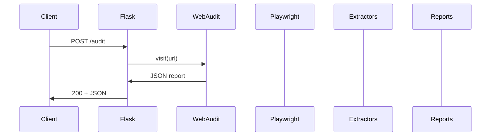

# 🔌 API Reference

Base URL (default): `http://localhost:5000`

## Endpoints

| Endpoint | Method | Purpose |
|----------|--------|---------|
| `/` | GET | Web UI |
| `/api` | GET | API information |
| `/health` | GET | Health check |
| `/audit` | POST | Single-page audit |
| `/site-audit` | POST | Site audit (single or sitemap crawl) |
| `/reports` | GET | List saved report directories |
| `/reports/<path>` | GET | Download a saved report file |

## `GET /api`

Returns basic API information.

## `GET /health`

Response:

```json
{ "status": "healthy", "timestamp": "...", "version": "1.0.0" }
```

## `POST /audit`

### Request

```json
{
  "url": "https://example.com",
  "save_screenshot": false,
  "save_html": false,
  "save_robots": false,
  "respect_robots": true
}
```

### Response (shape)

| Field | Type | Notes |
|------|------|------|
| `target` | object | final URL + status |
| `robots` | object | robots.txt status |
| `extracted` | object | extracted content |
| `duration` | object | timings in ms |
| `errors` | array | failures |
| `warnings` | array | non-fatal issues |

## `POST /site-audit`

### Request

```json
{
  "url": "https://example.com",
  "crawl_mode": "sitemap",
  "max_pages": 20,
  "save_screenshot": false,
  "respect_robots": true
}
```

### Response (shape)

| Field | Type | Notes |
|------|------|------|
| `site` | object | origin, hostname |
| `robots` | object | robots.txt status |
| `sitemap` | object | discovered URLs |
| `pages` | array | per-page results |
| `summary` | object | aggregated stats |
| `duration` | object | timings in ms |

## `GET /reports`

Response:

```json
{
  "reports": [
    {
      "name": "example.com_2025-12-16T21-08-38",
      "files": ["report.json", "report.md"],
      "created": "2025-12-16T21:08:38"
    }
  ]
}
```

## `GET /reports/<path>`

Static file download; returns the file content.

## Sequence Diagram (API)


