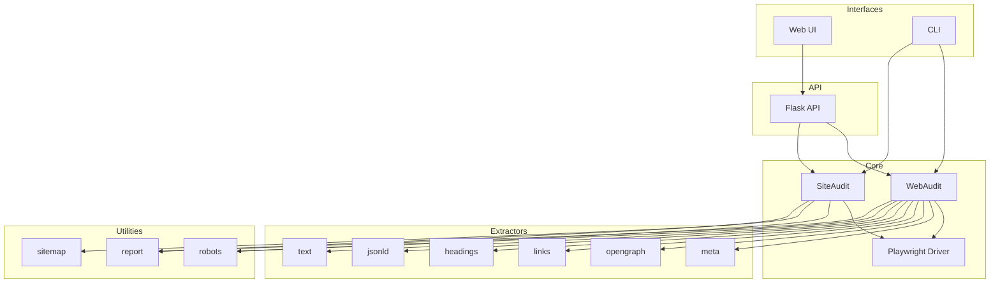
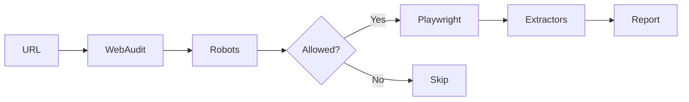
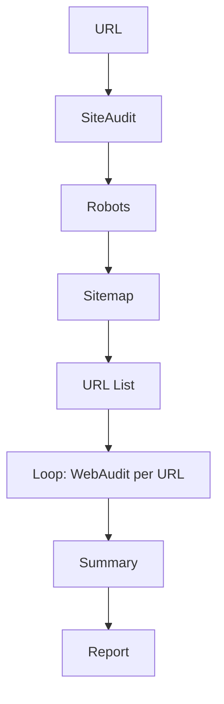

# 🏗️ Architecture

## High-Level Overview

Web Audit is a modular Python application with Flask API, CLI, and Playwright browser automation.

## System Diagram

## Component Table

| Layer | Component | File | Responsibility |
|-------|-----------|------|----------------|
| UI | HTML/CSS/JS | `templates/index.html` | Browser interface |
| CLI | Click + Rich | `cli.py` | Command-line wizard |
| API | Flask | `app.py` | HTTP endpoints |
| Core | WebAudit | `web_audit/audit.py` | Single-page orchestration |
| Core | SiteAudit | `web_audit/site_audit.py` | Multi-page crawl |
| Core | Driver | `web_audit/driver.py` | Playwright wrapper |
| Extract | Meta | `web_audit/extract/meta.py` | Meta tags |
| Extract | OpenGraph | `web_audit/extract/opengraph.py` | OG + Twitter |
| Extract | Links | `web_audit/extract/links.py` | Link parsing |
| Extract | Headings | `web_audit/extract/headings.py` | H1-H6 |
| Extract | JSON-LD | `web_audit/extract/jsonld.py` | Structured data |
| Extract | Text | `web_audit/extract/text.py` | Text preview |
| Util | Robots | `web_audit/robots.py` | robots.txt parser |
| Util | Sitemap | `web_audit/sitemap.py` | Sitemap parser |
| Util | Report | `web_audit/report.py` | JSON + MD generation |

## Data Flow (Single Page)

## Data Flow (Site Audit)

## Event System

WebAudit and SiteAudit emit events for observability:

| Event | When Fired | Payload |
|-------|------------|---------|
| `pipeline:start` | Audit starts | `{ url, config }` |
| `robots:fetch` | Before robots.txt | `{ url }` |
| `robots:result` | After robots.txt | `{ allowed, crawl_delay, sitemaps }` |
| `navigate:start` | Before page load | `{ url, driver }` |
| `navigate:complete` | After page load | `{ final_url, status, load_time_ms }` |
| `extract:start` | Before extraction | `{ extractors }` |
| `extract:complete` | After extraction | `{ extracted }` |
| `report:generated` | Report saved | `{ path, format }` |
| `pipeline:end` | Audit complete | `{ summary }` |
| `error` | Any error | `{ message }` |
| `*` | Wildcard for all events | Full event object |
