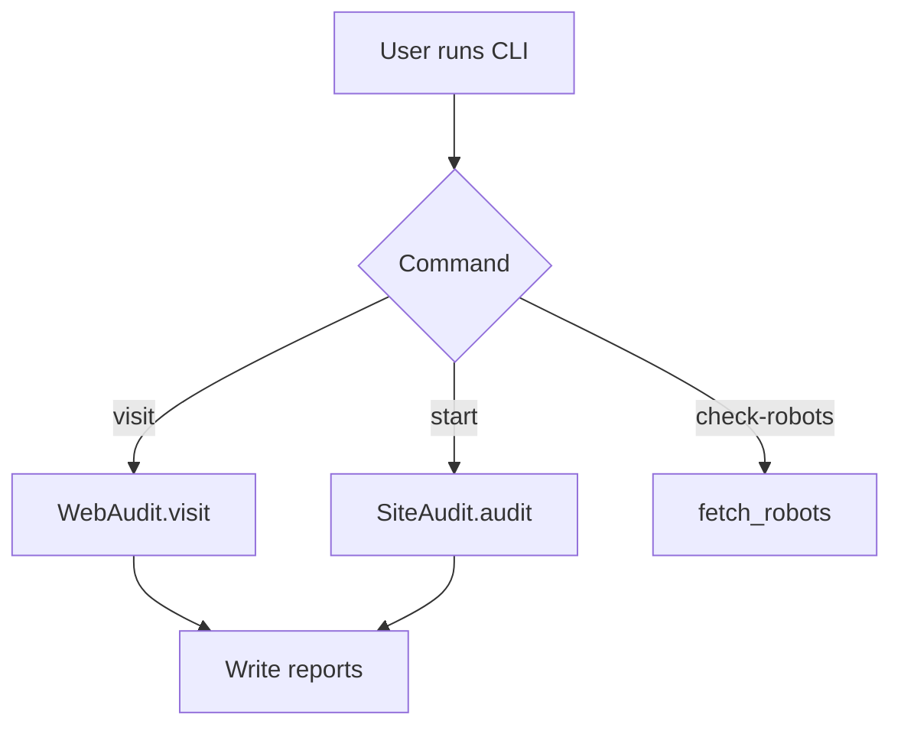

# 💻 CLI Guide

The CLI is implemented in `cli.py` using Click + Rich.

## Commands

| Command | Description |
|--------|-------------|
| `python cli.py` | Launch interactive wizard (same as `start`) |
| `python cli.py start` | Interactive site audit wizard |
| `python cli.py visit <url>` | Audit a single page |
| `python cli.py check-robots <url>` | Fetch/inspect robots.txt only |

## `visit` Command

### Syntax

```bash
python cli.py visit <url> [options]
```

### Options

| Option | Description | Default |
|--------|-------------|---------|
| `-o, --output` | Output directory | `./reports` |
| `-f, --format` | `json`, `md`, `both` | `both` |
| `--save-screenshot` | Save screenshot (`screenshot.png`) | `false` |
| `--save-html` | Save raw HTML (`page.html`) | `false` |
| `--save-robots` | Save `robots.txt` | `false` |
| `--save-all` | Save all artifacts | `false` |
| `--no-robots` | Ignore robots.txt | `false` |

### Output Layout (visit)

```
./reports/<host>_<timestamp>/
├── report.json
├── report.md
├── page.html            # optional
├── screenshot.png       # optional
└── robots.txt           # optional
```

## `start` Command (Interactive Wizard)

The wizard asks:

- URL
- Crawl mode (`single` or `sitemap`)
- Max pages (only for sitemap)
- Respect robots.txt
- Output directory
- Save screenshots

### Output Layout (start, sitemap mode)

```
./reports/<host>_<timestamp>/
├── report.json
├── report.md
├── pages/
│   ├── 1-Home.md
│   └── ...
└── screenshots/          # optional
    ├── 1-Home.png
    └── ...
```

## Mermaid Flowchart (CLI)


