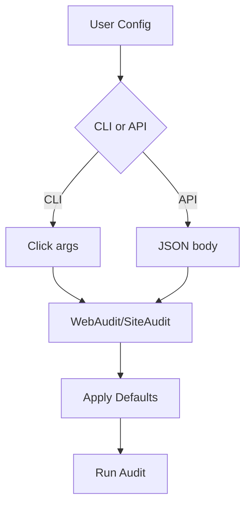

# ⚙️ Configuration

## WebAudit Options

| Option | Type | Default | Description |
|--------|------|---------|-------------|
| `user_agent` | str | `WebAuditBot/1.0 (+https://github.com/web-audit)` | User-Agent string |
| `respect_robots` | bool | `true` | Honor robots.txt |
| `timeout` | int | `30000` | Page load timeout (ms) |
| `save_html` | bool | `false` | Save raw HTML |
| `save_screenshot` | bool | `false` | Save screenshot |
| `save_robots` | bool | `false` | Save robots.txt |
| `output_dir` | str | `./reports` | Report directory |
| `format` | str | `both` | `json`, `md`, or `both` |

## SiteAudit Options

Includes all WebAudit options plus:

| Option | Type | Default | Description |
|--------|------|---------|-------------|
| `crawl_mode` | str | `single` | `single` or `sitemap` |
| `max_pages` | int | `20` | Max pages to crawl |
| `crawl_delay` | float | `1.0` | Delay between pages (seconds) |

## Example: Custom Config

```python
from web_audit import WebAudit

config = {
    "user_agent": "MyBot/1.0",
    "respect_robots": True,
    "save_screenshot": True,
    "output_dir": "./my-reports",
    "format": "json"
}

audit = WebAudit(config)
report = audit.visit("https://example.com")
```

## Environment Variables

| Variable | Effect |
|----------|--------|
| `REPORTS_DIR` | Overrides default reports directory |
| `PORT` | Flask server port (default 5000) |
| `FLASK_DEBUG` | Enable Flask debug mode |

## Mermaid Config Flow


