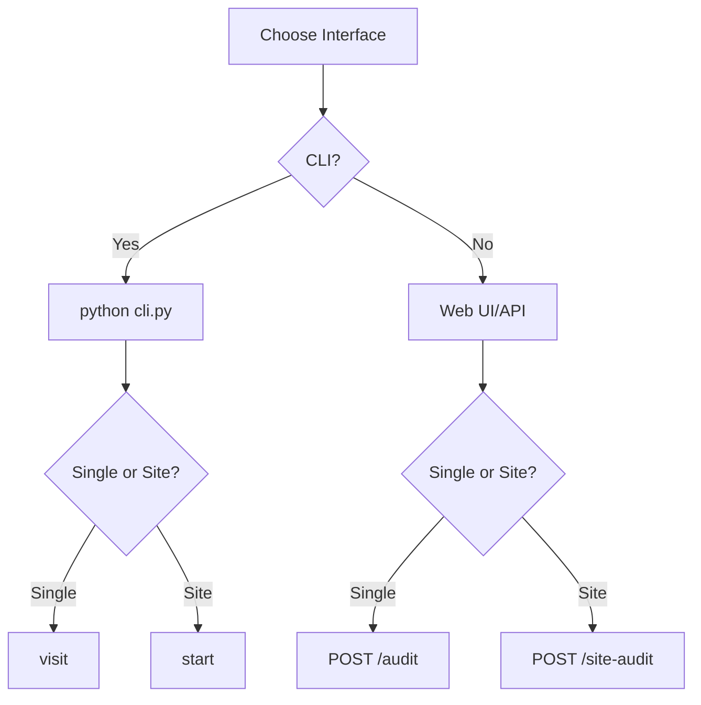

# 📚 Examples

## 1) Quick Single-Page Audit (CLI)

```bash
python cli.py visit https://example.com
```

## 2) Save Screenshot + HTML

```bash
python cli.py visit https://example.com --save-screenshot --save-html
```

## 3) Ignore robots.txt (for localhost)

```bash
python cli.py visit http://localhost:3000 --no-robots
```

## 4) Site Audit via Sitemap (Interactive)

```bash
python cli.py start
# Then answer prompts:
# URL: https://example.com
# Crawl mode: sitemap
# Max pages: 50
# Save screenshots: Yes
```

## 5) API: Single Page via curl

```bash
curl -X POST http://localhost:5000/audit \
  -H "Content-Type: application/json" \
  -d '{"url": "https://example.com", "save_screenshot": true}'
```

## 6) API: Site Audit via curl

```bash
curl -X POST http://localhost:5000/site-audit \
  -H "Content-Type: application/json" \
  -d '{"url": "https://example.com", "crawl_mode": "sitemap", "max_pages": 10}'
```

## 7) Python: Programmatic Single Page

```python
from web_audit import WebAudit

audit = WebAudit({
    "save_screenshot": True,
    "output_dir": "./my-reports"
})

report = audit.visit("https://example.com")
print(report["extracted"]["meta"]["title"])
```

## 8) Python: Programmatic Site Audit

```python
from web_audit import SiteAudit

audit = SiteAudit({
    "crawl_mode": "sitemap",
    "max_pages": 20,
    "save_screenshot": True
})

report = audit.audit("https://example.com")
print(report["summary"]["successful_pages"])
```

## 9) Event Listening

```python
from web_audit import WebAudit

def on_event(event):
    print(event["type"], event["data"])

audit = WebAudit()
audit.on("*", on_event)
audit.visit("https://example.com")
```

## 10) Custom Output Directory

```bash
export REPORTS_DIR=/tmp/audit-reports
python app.py
```

## Mermaid Decision Tree


