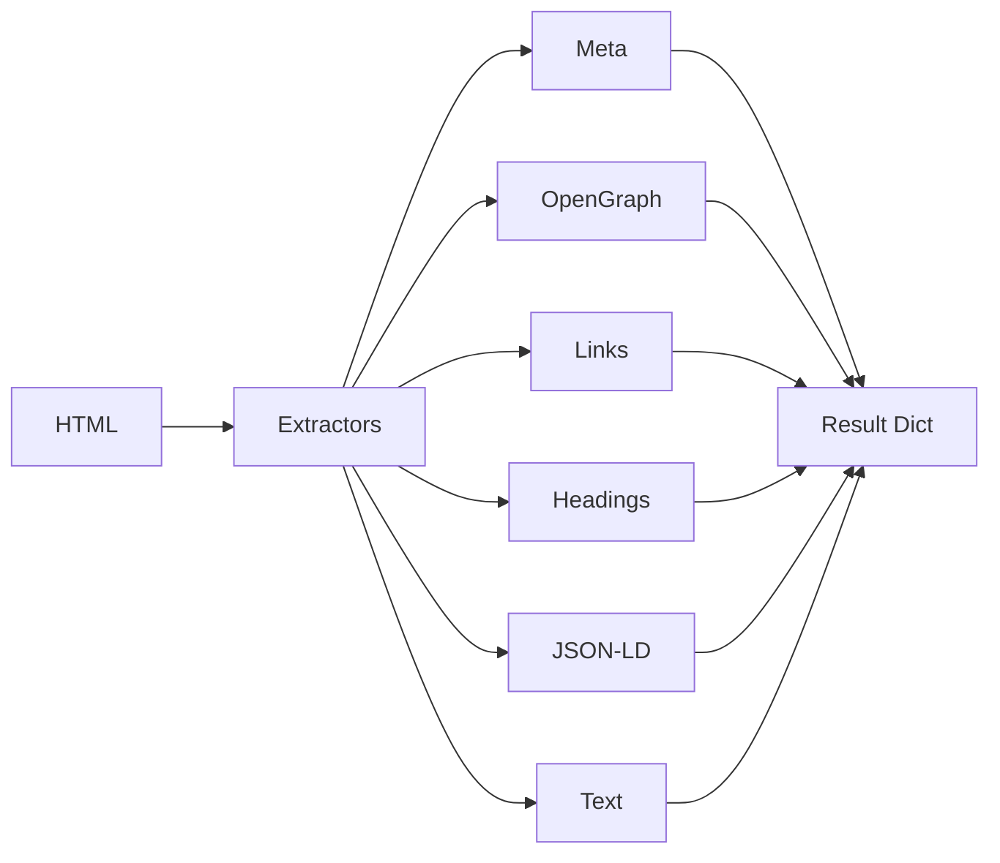

# 🔧 Extractors

All extractors live in `web_audit/extract/`. They accept HTML and return structured data.

## Extractor List

| Extractor | File | What It Extracts | Limits |
|-----------|------|------------------|-------|
| Meta | `meta.py` | title, description, canonical, robots, author, keywords | — |
| OpenGraph | `opengraph.py` | og:title, og:description, og:image, og:type, og:url, og:site_name | — |
| Twitter Card | `opengraph.py` | twitter:card, twitter:title, twitter:description, twitter:image, twitter:site | — |
| Links | `links.py` | Internal/external links with text | 500 each |
| Headings | `headings.py` | H1-H6 text | 100 per level |
| JSON-LD | `jsonld.py` | Structured data objects | All found |
| Text | `text.py` | Cleaned text preview | 10,000 chars |

## Usage Example

```python
from web_audit.extract import extract_all

html = "<html>...</html>"
base_url = "https://example.com"

data = extract_all(html, base_url)
# Returns dict with keys: meta, open_graph, twitter_card, links, headings, json_ld, text_preview
```

## Mermaid Flow (Extraction)



## Implementation Notes

- All extractors use regex for speed (not BeautifulSoup)
- Links are normalized against `base_url`
- Duplicate URLs are deduplicated
- Text extraction strips scripts/styles and normalizes whitespace
- Headings decode HTML entities and truncate if too long
