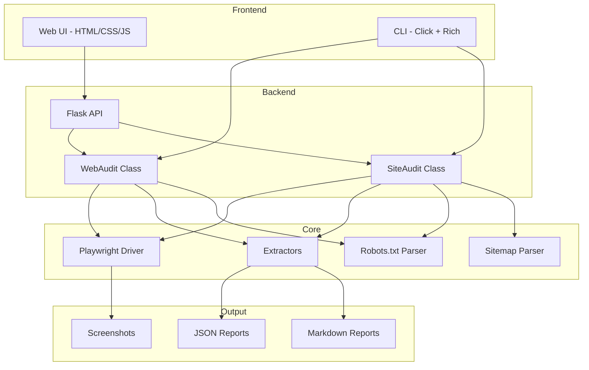
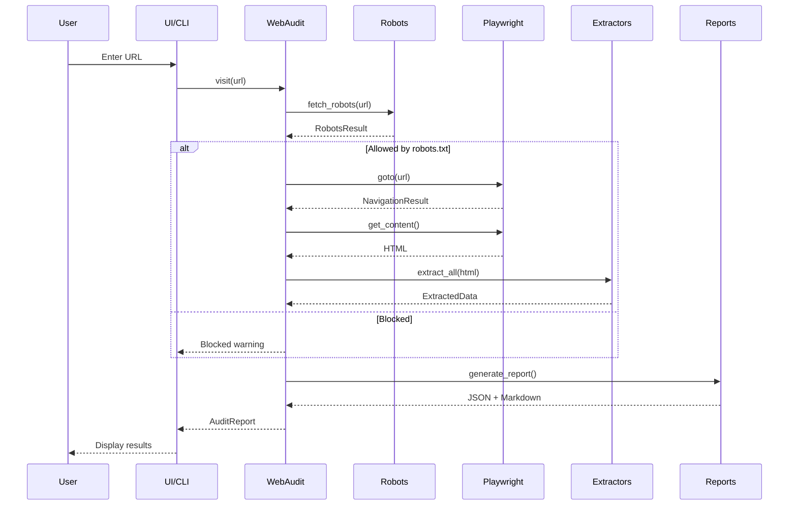

# 🔍 Overview

Web Audit is a **robots.txt-compliant** web content extraction tool built with Python, Flask, and Playwright.

## ✨ Key Features

| Feature | Description |
|---------|-------------|
| 🤖 **Robots.txt Compliance** | Automatically respects robots.txt rules, crawl-delay, and sitemap discovery |
| 🎭 **Playwright Extraction** | Uses a real headless browser for accurate JS-rendered content |
| 📊 **Rich Data Extraction** | Extracts metadata, OpenGraph, Twitter Cards, JSON-LD, links, headings (H1-H6) |
| 📄 **Multiple Report Formats** | Generates JSON and Markdown reports |
| 🌐 **Web UI** | Beautiful browser-based interface |
| 🔌 **REST API** | Programmatic access via HTTP endpoints |
| 💻 **CLI** | Interactive command-line wizard |
| 📸 **Screenshots** | Optional full-page screenshot capture |

## 🎯 Use Cases

- **SEO Audits**: Analyze page metadata, headings, and structured data
- **Content Inventory**: Catalog all pages on a website
- **Competitive Analysis**: Extract and compare content from competitor sites
- **Quality Assurance**: Verify metadata and OpenGraph tags are properly set
- **Migration Planning**: Document existing content before site migrations

## 🏗️ Technology Stack

## 📦 Components

| Component | File | Purpose |
|-----------|------|---------|
| Web UI | `app.py` + `templates/` | Browser-based interface |
| CLI | `cli.py` | Command-line interface |
| WebAudit | `web_audit/audit.py` | Single-page audit orchestration |
| SiteAudit | `web_audit/site_audit.py` | Multi-page site crawling |
| Driver | `web_audit/driver.py` | Playwright browser automation |
| Extractors | `web_audit/extract/` | Content extraction modules |
| Robots | `web_audit/robots.py` | Robots.txt handling |
| Sitemap | `web_audit/sitemap.py` | Sitemap parsing |
| Reports | `web_audit/report.py` | Report generation |

## 🔄 Data Flow

## 📊 Extraction Capabilities

| Data Type | Description | Max Items |
|-----------|-------------|-----------|
| Meta Tags | title, description, canonical, robots, author, keywords | - |
| OpenGraph | og:title, og:description, og:image, og:url, og:type | - |
| Twitter Card | twitter:card, twitter:title, twitter:description, twitter:image | - |
| Headings | H1 through H6 | 100 per level |
| Links | Internal and external links | 500 each |
| JSON-LD | Structured data objects | All found |
| Text Preview | Cleaned text content | 10,000 chars |

## 🛡️ Robots.txt Compliance

The tool respects robots.txt by default:

1. ✅ Fetches `/robots.txt` before visiting any page
2. ✅ Checks if URL is allowed for the user-agent
3. ✅ Respects `Crawl-delay` directives
4. ✅ Discovers sitemaps from `Sitemap:` directives
5. ✅ Records blocked status in reports

## 📈 Performance

| Metric | Typical Value |
|--------|---------------|
| Single page audit | 2-5 seconds |
| Page load timeout | 30 seconds |
| Max pages per site audit | 100 (configurable) |
| Default crawl delay | 1 second |
